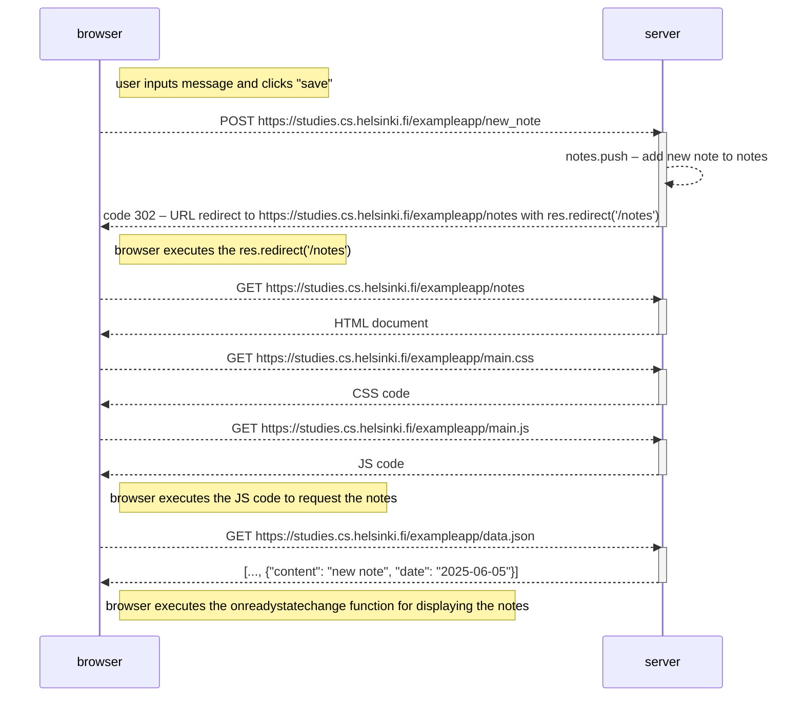

Adding new note in https://studies.cs.helsinki.fi/exampleapp/notes.

```mermaid
sequenceDiagram
  participant browser
  participant server

  Note right of browser: user inputs message and clicks "save"
  browser-->>server: POST https://studies.cs.helsinki.fi/exampleapp/new_note
  activate server
  server-->>server: notes.push – add new note to notes
  server-->>browser: code 302 – URL redirect to https://studies.cs.helsinki.fi/exampleapp/notes with res.redirect('/notes')
  deactivate server

  Note right of browser: browser executes the res.redirect('/notes')
  browser-->>server: GET https://studies.cs.helsinki.fi/exampleapp/notes
  activate server
  server-->>browser: HTML document
  deactivate server

  browser-->>server: GET https://studies.cs.helsinki.fi/exampleapp/main.css
  activate server
  server-->>browser: CSS code
  deactivate server

  browser-->>server: GET https://studies.cs.helsinki.fi/exampleapp/main.js
  activate server
  server-->>browser: JS code
  deactivate server

  Note right of browser: browser executes the JS code to request the notes
  browser-->>server: GET https://studies.cs.helsinki.fi/exampleapp/data.json
  activate server
  server-->>browser: [..., {"content": "new note", "date": "2025-06-05"}]
  deactivate server

  Note right of browser: browser executes the onreadystatechange function for displaying the notes
```
