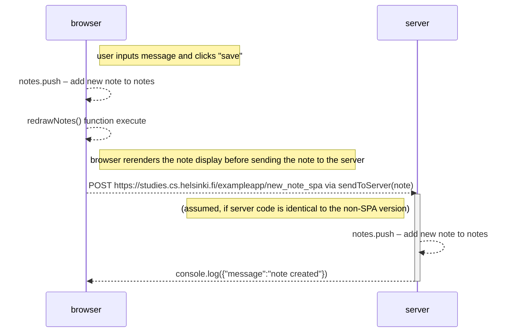

Adding new note in SPA https://studies.cs.helsinki.fi/exampleapp/spa

```mermaid
sequenceDiagram
  participant browser
  participant server

  Note right of browser: user inputs message and clicks "save"
  browser-->>browser: notes.push – add new note to notes
  browser-->>browser: redrawNotes() function execute
  Note right of browser: browser rerenders the note display before sending the note to the server
  browser-->>server: POST https://studies.cs.helsinki.fi/exampleapp/new_note_spa via sendToServer(note)
  activate server
  Note left of server: (assumed, if server code is identical to the non-SPA version)
  server-->>server: notes.push – add new note to notes
  server-->>browser: console.log({"message":"note created"})
  deactivate server
```
