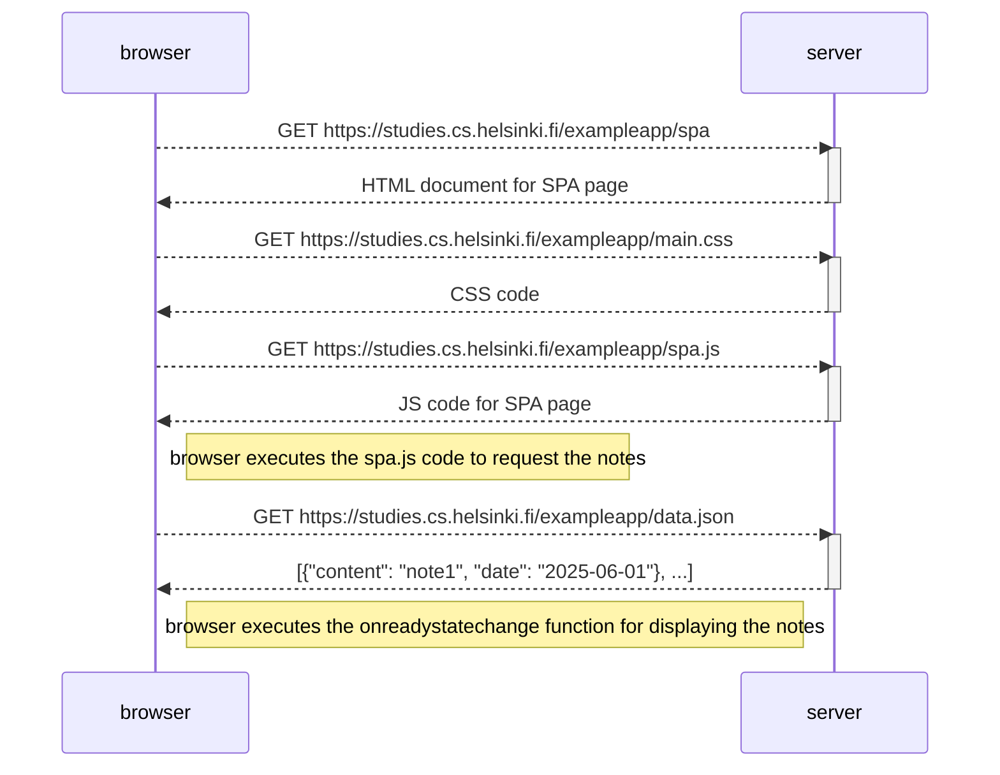

SPA sequence diagram for https://studies.cs.helsinki.fi/exampleapp/spa

```mermaid
sequenceDiagram
  participant browser
  participant server

  browser-->>server: GET https://studies.cs.helsinki.fi/exampleapp/spa
  activate server
  server-->>browser: HTML document for SPA page
  deactivate server

  browser-->>server: GET https://studies.cs.helsinki.fi/exampleapp/main.css
  activate server
  server-->>browser: CSS code
  deactivate server

  browser-->>server: GET https://studies.cs.helsinki.fi/exampleapp/spa.js
  activate server
  server-->>browser: JS code for SPA page
  deactivate server

  Note right of browser: browser executes the spa.js code to request the notes
  browser-->>server: GET https://studies.cs.helsinki.fi/exampleapp/data.json
  activate server
  server-->>browser: [{"content": "note1", "date": "2025-06-01"}, ...]
  deactivate server

  Note right of browser: browser executes the onreadystatechange function for displaying the notes
```
